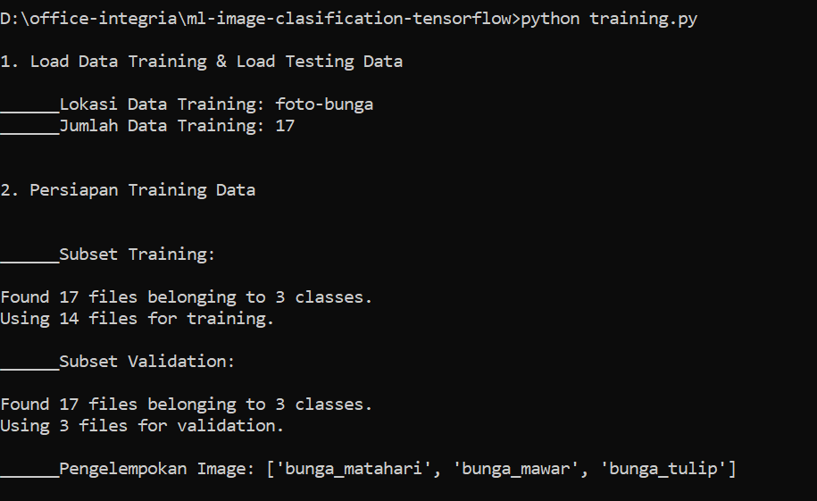
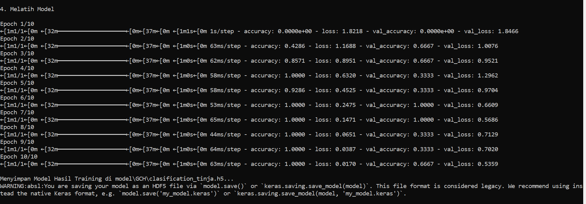
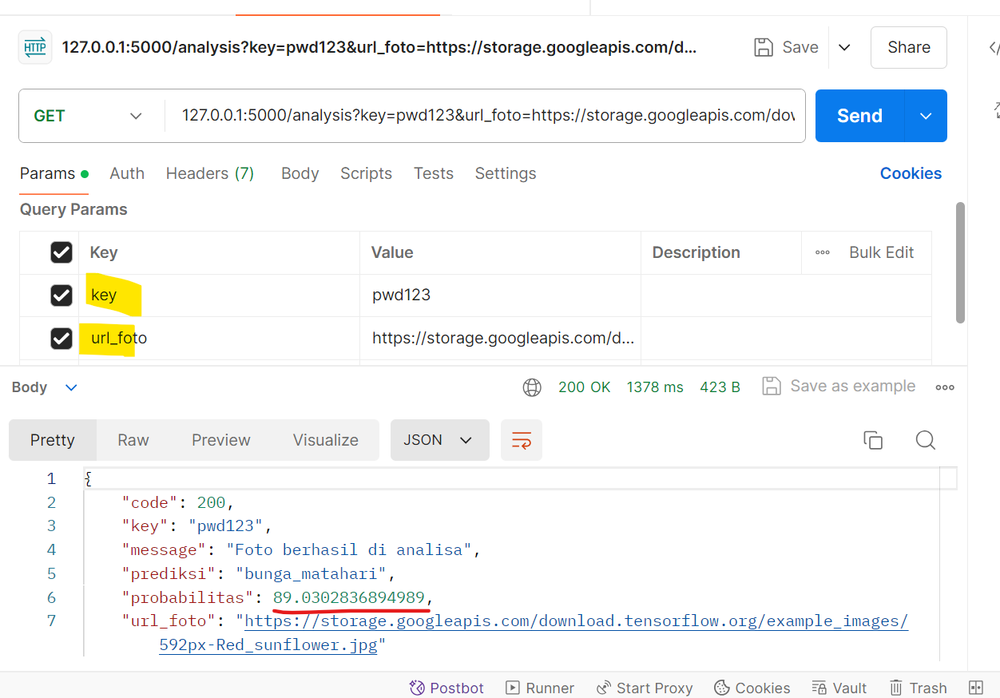

# Machine Learning Image Classification using Tensorflow

## Introducing

A machine learning for classifying/categorizing photos, for example to find out what type of flower a photo is being checked 

(expamle: rose, tulip, ect). Machine Learning using Google Tensorflow library

## Module Dependencies
- pip install requests
- pip install numpy
- pip install tensorflow
- pip install pathlib
- pip install image
- pip install flask
- pip install matplotlib

## Machine Learning Training (Via Command Line)

<code>python training.py</code>

This command is to train the machine learning algorithm so that it can recognize image patterns

Produces a training result modeling named clasification_flower.h5

## Check Probability Image Classification (Via Command Line)

<code>python prediction.py</code>

this command is to do the probability of an image entering an image classification

## Run API Server

A way is provided for Probaility Image Classification via Rest API

Choose one of the methods below

to enter the environment

<code>python -m venv env</code>

to enter the environment on windows

<code> env\Scripts\activate or env/bin/activate </code>

to enter the Linux environment

<code> source env\Scripts\activate or env/bin/activate </code>

Run application api

<code> python app.py </code>

to run a service in the background or become a daemon

<code>nohop python app.py</code>

 

## Test Image Classification Via API 

Here is an example of checking Image Classification Probability via Rest API  

## Document 

Installation Tenfosflow Installation in Python -> https://www.tensorflow.org/install/pip 

Tensor Flow Image Classification Material -> https://www.tensorflow.org/tutorials/images/classification 

Convert Online zip to tar.gz -> https://anyconv.com/zip-to-tgz-converter/ 

Pyhton Flask Microframework Installation - Creating an API Service https://blog.javan.co.id/restful-api-sederhana-cepat-flask-dbb8fe9718d8

## Firewall Open Port Open Port 5000 

  Open Port 5000 for webserver python running default 

  sudo ufw allow from any to any port 5000 proto tcp

## Contact

If you have question, you can contact this email   
Email: dendie.sanjaya@gmail.com

## License

This project is licensed under the Apache License.

  
